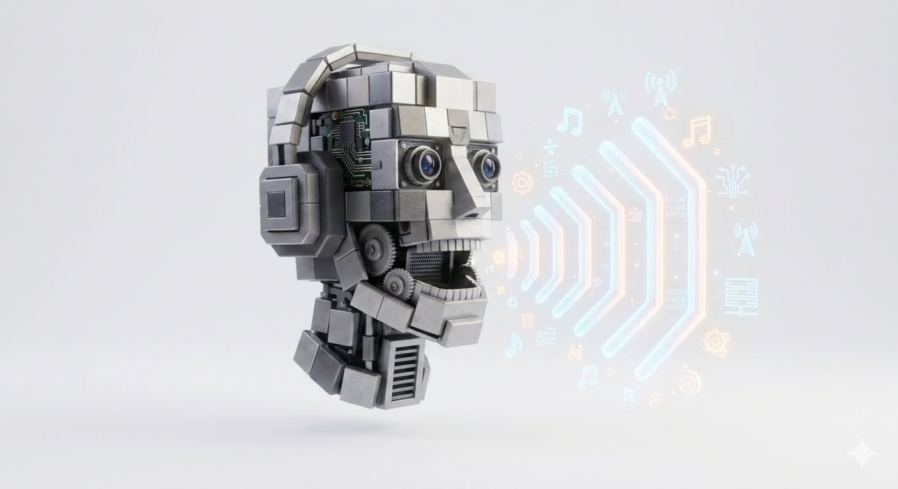

  

# 🎼 🌐 Ppls-Voice-Recognition-Speaker

A high-performance, open-source speaker recognition ecosystem optimized for identifying stars, athletes, and crowdsourced voices.

## Badges

| Category | Technologies |
| :--- | :--- |
| **Languages** |      |
| **Systems** |    |
| **Architecture** |    |
| **Performance** |   |
| **Security** |    |
| **DevOps** |     |
| **AI & Audio** |     |

## Why is this cool?

*   **Blazing Speed & Hardware Optimization:** Leverages C++ AVX-512 intrinsics and Pybind11 to compute vector comparisons at hardware-level speeds.
*   **Multimodal Architecture:** Seamlessly merges machine learning inference, high-concurrency Go ingestion workers, containerized deployment, and decentralized Web3 ledgers.
*   **Studio-Ready Metrics:** Bridges the gap between experimental AI models and real-world audio production tools by tracking plugin latency constraints for industry-standard DAWs like Pro Tools and FL Studio.

## How this works?

1.  **Infiltration & VAD:** Audio files enter through the FastAPI backend or Go ingestion workers, where Voice Activity Detection strips silence and isolates vocal tracts.
2.  **Feature Extraction:** PyTorch and SpeechBrain convert the processed audio slice into a 192-dimensional vector embedding.
3.  **SIMD Matching:** The query vector is passed to the execution layer to perform fast cosine similarity comparisons against database matrices using AVX-512 SIMD instructions.

## System Architecture

This repository operates across three distinct layers to ensure maximum throughput and security:

1. **AI & DSP Layer (Python 3.11)**
   *   `src/quantum_unit.py` manages audio ingestion and routes signals to PyTorch/SpeechBrain.
   *   Outputs a 192-dimensional vector embedding.

2. **Execution Layer (C++ 17 / AVX-512)**
   *   `core/vector_engine.cpp` bypasses Python's GIL for heavy matrix multiplication.
   *   Executes 1:N cosine similarity searches across millions of cached voiceprints in sub-millisecond timeframes.

3. **Consensus Layer (Solidity)**
   *   `contracts/VoiceRegistry.sol` provides immutable anchoring.
   *   Hashed embeddings are stored on-chain to provide zero-knowledge proof of voice authentication without leaking biometric data.
